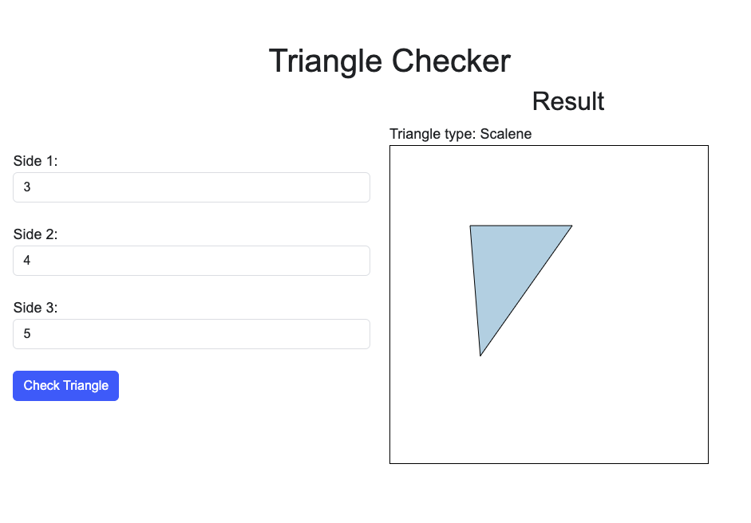

# Activity 6 - DevOps with Azure 

## Table of Contents

1. [Overview](#overview)
2. [The Application](#the-application)
3. [How to run locally](#how-to-run-locally)
4. [Setting up Azure DevOps](#setting-up-azure-devops)
    1. [Create an Azure DevOps project](#create-an-azure-devops-project)
    2. [Creating Work Boards](#creating-work-boards)
    3. [Defining Work Items](#defining-work-items)
    4. [Importing Code from GitHub](#importing-code-from-github)
    5. [Creating a Pipeline](#creating-a-pipeline)
5. [Configuring Azure App Service Deployment](#configuring-azure-app-service-deployment)
6. [Running the Pipeline and Deployment](#running-the-pipeline-and-deployment)
7. [Accessing the Deployed Application](#accessing-the-deployed-application)
8. [Conclusion](#conclusion)


## Overview
In this Activity a pre-defined Triangle app (used for the Unit testing in Activity 3) is converted in to a web app. The objective of this activity is to use Azure DevOps Pipelines to build and deploy the web app. 
The steps provided will will guide students through setting up a DevOps project in Azure DevOps (similar to what we discussed in the class/Slides), creating work boards for managing tasks (you can choose between Basic, Scrum and Agile), then use Kanban boards to manage tasks.It will also guide you through building and deploying a web app built with Express to Azure App Service.
## The Application

You can Fork this repository or download the source code from [here](https://github.com/umassd-dataviz/CIS470-Activity-6?tab=readme-ov-file) and run it locally.

In case you download the source code you will need to make a new GitHub repository and push the code to it.

## How to run locally

The app provided is fully functional and you can run it in GitHub Codespaces or in the browser. To ran the app in the browser you need to have Node.js installed on your computer.

First install the following dependencies:
```bash
npm install
```

Then run the following command:
```bash
nodemon
```
You should see the following output in browser: http://localhost:3000

You should be able to see the triangle in the browser.'

You can also test the main function for the app using the following command:
``` bash 
npm test
```



## Setting up Azure DevOps

### Create an Azure DevOps project
Log in to https://dev.azure.com/

Click on "Create project" and choose a name for your project (e.g., CIS470-DevOps-Activity).
Select "Blank project" and choose private.

### Creating Work Boards:

Navigate to Boards -> Boards.
Click on New board.
Choose either "Basic", "Scrum" or "Agile" template and provide a name (e.g., CIS470-Activity-Board).

### Defining Work Items:

Go to the newly created board and click on Columns.
Add various columns representing different stages of your workflow (example: New Tasks, In Progress, Testing, Done).

Click on Work items.
Choose "Add work item type" and select the relevant types for your project (e.g., User Story, Bug, Task).
Define the fields for each work item type (e.g., Title, Description, Assigned To).

### Importing Code from GitHub:

Navigate to Repos in your Azure DevOps project.
Click on Import.
Choose "GitHub" as the source provider.
Connect your Azure DevOps account to your GitHub account.
Select the "CIS470-Activity-6" repository and configure the import settings (e.g., branch to import).

### Creating a Pipeline:

Go to Pipelines -> Releases.
Click on New pipeline.
Choose "Empty pipeline" and select your Azure DevOps repository.
In the YAML editor, paste the following code and customize it as needed:

```yaml
trigger:
- main

pool:
  vmImage: 'ubuntu-latest'

steps:
- script: npm install
  displayName: 'Install dependencies'

- script: npm test
  displayName: 'Run tests'

- task: AzureRmWebappDeployment@v4
  inputs:
    azureSubscription: '$(SubscriptionId)'
    resourceGroup: 'your-resource-group-name'  # Replace with your resource group name
    appName: 'your-app-name'                 # Replace with your desired app name
    packageLocation: '$(Build.ArtifactStagingDirectory)'
    publishProfile: '$(Build.ArtifactStagingDirectory)/azure-app-service-publish.json'

```

## Configuring Azure App Service Deployment:

You'll need an Azure App Service to deploy your web app. There are two ways to achieve this:

You can refer to the video I have added to myCourses in Homework 4 for the steps.

To create an App Service: Go to the Azure portal (https://azure.microsoft.com/en-us/get-started/azure-portal), create a new Web App resource, configure settings like resource group, location, and app service plan.

## Running the Pipeline and Deployment:

Go back to your pipeline in Azure DevOps.
Click on "Run pipeline".
The pipeline will first install dependencies, run tests, and then deploy the app to the configured Azure App Service.

## Accessing the Deployed Application:

Once the deployment is successful, navigate to the URL of your Azure App Service in a web browser. This URL will be similar to `http://your-app-name.azurewebsites.net.